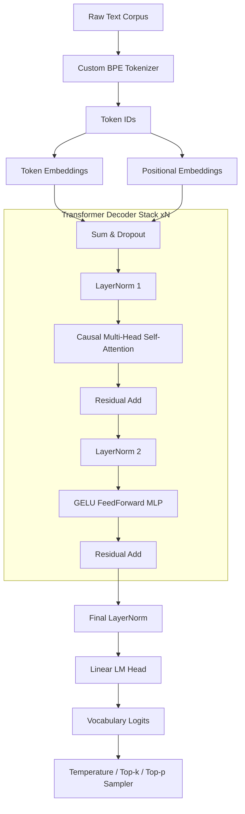

# LLM From Scratch - GPT Architecture & BPE Tokenizer in PyTorch

A complete, production-grade GPT-style Causal Language Model built completely from scratch in PyTorch without using external transformer libraries. Features a custom **Byte-Pair-Encoding (BPE) Tokenizer**, custom **Transformer Decoder Architecture** (`CausalSelfAttention`, `FeedForward`, `LayerNorm`, `TransformerBlock`), next-token pretraining, instruction fine-tuning, autoregressive sampling (Temperature, Top-$k$, Top-$p$), perplexity evaluation, and an interactive FastAPI Web UI.

---

## Architecture Overview



---

## Implemented Core Modules

1. **Custom BPE Tokenizer (`tokenizer.py`)**:
   - Learns subword merge rules from text corpus by pair frequency counting.
   - Special tokens: `<pad>` (0), `<unk>` (1), `<bos>` (2), `<eos>` (3).
   - Encodes text strings into subword IDs and decodes IDs back to text.

2. **Custom GPT Transformer Decoder (`model.py`)**:
   - **`LayerNorm`**: Custom Layer Normalization with learnable scale $\gamma$ and shift $\beta$.
   - **`CausalSelfAttention`**: Multi-head self-attention with lower-triangular causal masking to prevent future token attention.
   - **`FeedForward`**: GELU-activated two-layer MLP with $4 \times d_{\text{model}}$ hidden expansion.
   - **`TransformerBlock`**: Pre-LayerNorm block architecture with residual skip connections.
   - **`GPTModel`**: Weight-tied embedding & LM head, stacking $N$ transformer blocks.

3. **Pretraining & Instruction Fine-Tuning (`trainer.py` & `dataset.py`)**:
   - **Next-Token Prediction**: CrossEntropyLoss on shifted target sequences.
   - **Instruction Fine-Tuning**: Formats prompt `User: ... \n Assistant: ...` with prompt masking in targets.
   - **Perplexity Metric**: Tracks $\text{PPL} = \exp(\mathcal{L})$ during training.

4. **Text Generation & Sampling (`generate.py`)**:
   - Autoregressive generation loop with Temperature, Top-$k$, and Top-$p$ (Nucleus) sampling.

---

## Directory Structure

```
llm_from_scratch/
├── __init__.py           # Package exports and version metadata
├── tokenizer.py          # Custom BPE Tokenizer module
├── model.py              # Custom PyTorch GPT Decoder Architecture
├── dataset.py            # TextDataset & InstructionDataset with prompt masking
├── trainer.py            # Pretraining & Fine-tuning trainer with perplexity tracking
├── generate.py           # TextGenerator sampler (Temperature, Top-k, Top-p)
├── evaluate.py           # Evaluation pipeline & model scaling calculator
├── app.py                # FastAPI web server and REST API endpoints
├── static/
│   ├── style.css         # Dark/light glassmorphism CSS UI styling
│   └── script.js         # Frontend playground interaction & REST client logic
├── templates/
│   └── index.html        # Main HTML web app template
└── tests/                # Unit test suite
    ├── test_tokenizer.py
    ├── test_model.py
    └── test_generate.py
```

---

## Quick Start

### 1. Launching LLM Studio Web App
Start the FastAPI server using Uvicorn:
```bash
python -m uvicorn llm_from_scratch.app:app --host 127.0.0.1 --port 8002
```
Open your browser and navigate to:
```
http://127.0.0.1:8002
```

### 2. Running Evaluation Pipeline
Run pretraining, instruction fine-tuning, and qualitative sample output evaluation:
```bash
python -m llm_from_scratch.evaluate
```

### 3. Running Unit Tests
Execute the unit test suite:
```bash
python -m unittest discover -s llm_from_scratch/tests
```

---

## Performance & Benchmark Metrics

Evaluated over sample pretraining text and instruction dataset:

| Metric / Stage | Initial / Before | Pretrained (10 Epochs) | Fine-Tuned (15 Epochs) |
| :--- | :--- | :--- | :--- |
| **CrossEntropy Loss ($\mathcal{L}$)** | ~5.1874 | **3.1346** | **1.7558** |
| **Perplexity ($\text{PPL} = e^{\mathcal{L}}$)** | ~179.0 | **22.9788** | **5.7880** |

---

## Model Scaling Choices

- **Trainable Parameters**: **822,400 (0.8224 M)**
- **Model Dimension ($d_{\text{model}}$)**: 128
- **Transformer Layers ($L$)**: 4
- **Attention Heads ($H$)**: 4 ($d_{\text{head}} = 32$)
- **Context Length ($T$)**: 64 tokens
- **FLOPs per Token**: $\approx 2 \times N = 1.64 \times 10^6$ FLOPs

---

## License
MIT License
